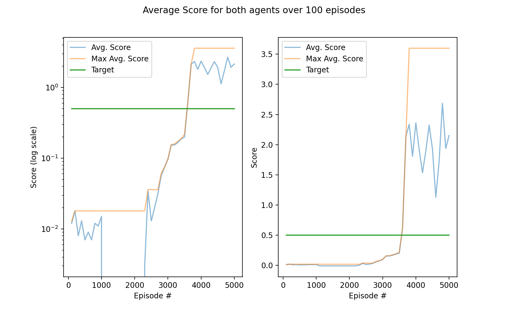

# Multi-agent Deep Reinforcement Learning solves tennis environment

This repo solves the 'Tennis' environment as part of Udacity's Deep Reinforcement Nanodegree.

In this environment, two agents control rackets to bounce a ball over a net. If an agent hits the ball over the net, it receives a reward of +0.1. If an agent lets a ball hit the ground or hits the ball out of bounds, it receives a reward of -0.01. Thus, the goal of each agent is to keep the ball in play.

The observation space consists of 8 variables corresponding to the position and velocity of the ball and racket. Each agent receives its own, local observation. Two continuous actions are available, corresponding to movement toward (or away from) the net, and jumping.

The task is episodic, and in order to solve the environment, your agents must get an average score of +0.5 (over 100 consecutive episodes, after taking the maximum over both agents). Specifically,

- After each episode, we add up the rewards that each agent received (without discounting), to get a score for each agent. This yields 2 (potentially different) scores. We then take the maximum of these 2 scores.
- This yields a single **score** for each episode.

The environment is considered solved, when the average (over 100 episodes) of those **scores** is at least +0.5.


## Installation

The following should get you going:

#### Install dependencies

```bash
conda create -n tennis python=3.6 --yes
conda activate tennis
pip install -r requirements.txt # make sure you're in the repo directory
```

#### Download and install Tennis environment

Download the unity environment that matches your operating system (note you don't need to install unity, only the environment file below). Place in the root folder of the repo:

- Linux: [click here](https://s3-us-west-1.amazonaws.com/udacity-drlnd/P3/Tennis/Tennis_Linux.zip)
- Mac OSX: [click here](https://s3-us-west-1.amazonaws.com/udacity-drlnd/P3/Tennis/Tennis.app.zip)
- Windows (32-bit): [click here](https://s3-us-west-1.amazonaws.com/udacity-drlnd/P3/Tennis/Tennis_Windows_x86.zip)
- Windows (64-bit): [click here](https://s3-us-west-1.amazonaws.com/udacity-drlnd/P3/Tennis/Tennis_Windows_x86_64.zip)

Run `test.py` to run the environment with random actions to see if everything is working:

```bash
python test.py
```
## Run

#### Train

To test everything is working first try `python test.py`. This will run for one episode with random actions.

If all looks good run with default parameters (on OSX):

```bash
python agent_runner.py
```

for other operating systems, run with the name of your environment file that you downloaded:

```bash
python agent_runner.py --env '<environment filename>'
```

#### Plot

Plot training scores from logfile with

```bash
python agent_runner.py --mode 'plot' --load 'final_agent_log.txt'
```


## Results

See **[REPORT](REPORT.md)** for details. Figure below plots the score over time.



