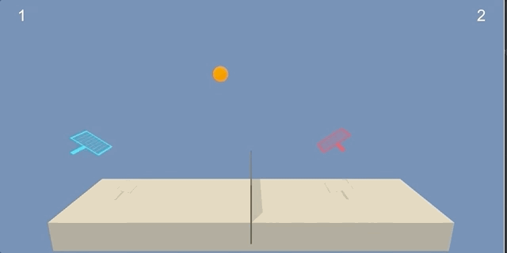

# Solving Tennis environment with MADDPG

## Description of Algos used

MADDPG is an adaptation of the DDPG algorythm for use in multi-agent environments. For a brief review of DDPG and its implementation [see my reacher-environment solution](https://github.com/z33bs/deep-rl-agent-solves-unity-reacher/blob/main/REPORT.md). The challenge in using single agent algo's in a multi-agent environment is that the environment becomes non-stationary from the perspective of any individual agent (in a way that is not explainable by changes in the agent’s own policy). This non-stationarity leads to unstable training.

MADDPG overcomes this by a simple extension of the actor-critic framework where they use a <u>centralised critic</u> function during training. This centralised critic is aware of all the agents' observations and actions. Each agent learns its own centralized critic, allowing for agents with differing reward functions.

The actors only have access to local information as before. During execution, only the local actors are used, acting in a decentralised manner. Hence MADDPG is a framework of centralized training with decentralized execution. MADDPG can be applied to competitive, co-operative and mixed environments.  

Figure below summarizes the structure:

The critic is a centralized action-value function that takes in all the observations and actions from every agent. This ensures that the environment is stationary even as the agents' policies change.

For more details, consult the  [see the original paper](https://arxiv.org/abs/1706.02275) that discusses other interesting details such as:

* inferring other agents' actions by maintaining an approximation of their policies (not in this implementation)
* using an ensemble of policies to better generalize (not in this implementation)

The implmentation of the algo in pseudocode is shown below:

## Approach

I found the key to solving this environment is achieving the right balance between exploration and exploitation. Its important to let the agents fully explore the environment in the beginning. Since its difficult to randomly hit the ball over the net, you need enough random iterations to 'see' the reward.

I first tried O-U noise, but found the parameters difficult to tune. The final implementation simply blends purely random actions with policy-actions using a weighting. This weight decays over time during training.

My final model used the following hyper parameters:

* Networks. For each agent, an actor, target_actor, critic, and target_critic. Target networks are identical to local networks.
  * Actor
    * Input state, 24
    * Hidden layers of 256 and 128
    * Output action, 2 in range -1 to 1
    * Adam optimiser with LR = 1e-3
    * Random noise function
  * Central Critic
    * Input states and actions for all agents, 52
    * Hidden layers of 512 and 256
    * Output dims, 1
    * Adam optimiser with LR = 1e-3
* Disount factor (gamma) of 0.99
* Replay buffer size of 100 000 samples
* Minibatch size of 128
* Soft update rate tau of 0.001
* Noise. Uniform random action between -1 to 1.
  * Weight starts at 100% and maintains this for 1000 episodes
  * thereafter decays at 0.9977 per episode

## Results

Figure below shows a plot of the score over time. The network performed extremely well, first exceeding an average score of 0.5 before 2800 episodes. The network continued to improve with further training, achieving a maximum average of 3.6 by episode 3800. Training appeared to plateau at this point, but remained stable which I am happy about.

The clip below shows the trained agents playing:

## Future work

I believe prioritized experience replay would help the network learn faster. This would be my first addition.

Another trick that might reduce accelarate the learning curve would be to do several batch sampling for every time-step of experience collection. Currently the model only does one batch after every trajectory collection. You could increase this supervised-learning step; however by doing this you risk creating instability due to diverging local and target networks. One might consider using ks-stopping like what OpenAI did with their PPO1 algorithm. 

I'm curious to implement the enhancements mentioned in the original paper, namely:

* inferring other agents' actions by maintaining an approximation of their policies
* using an ensemble of policies to better generalize

I'm also curious to implement with only one centralized critic. In this environment it should be possible to have a shared critic. This would have the effect of speeding up training and possibly convergence.

On the network architecture:

* I could also get more fancy with weight initialisation like Kaimer
* I could add dropout layers to ensure the network generalizes well (perhaps improving stability). This would likely be at the expense of a slower learning-curve.
* I could try train networks with a larger capacity and see if this improves the max-score that the agents can achieve. Network should train longer without plateauing.

I would also like to explore a parallel-processing CPU implementation to speed up training, given that this algo doesn't get much benefit from GPU.